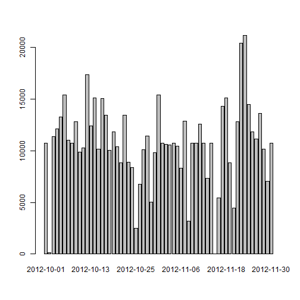

## Loading and preprocessing the data

Show any code that is needed to

**1.Load the data (i.e. read.csv())**

**2.Process/transform the data (if necessary) into a format suitable for your analysis**


```r
unzip("activity.zip")
activity <- read.csv("activity.csv",header= TRUE, na.strings="NA")
activity$date <- as.Date(activity$date, format="%Y-%m-%d")
```

## What is mean total number of steps taken per day?

For this part of the assignment, you can ignore the missing values in the dataset.

**1.Calculate the total number of steps taken per day**


```r
dailySteps <- aggregate(activity$steps, list(activity$date), sum, na.rm=TRUE )
names(dailySteps) <- c("date","steps")
```

**2.If you do not understand the difference between a histogram and a barplot, research the difference between them. Make a histogram of the total number of steps taken each day**


```r
barplot(dailySteps$steps, names.arg=dailySteps$date)
```


**3.Calculate and report the mean and median of the total number of steps taken per day**


```r
dailyMean <- mean(dailySteps$steps)
dailyMedian <- median(dailySteps$steps)
```

- The mean total number of steps taken per day is 9354.2295082
- The Median total number of steps taken per day is 10395

## What is the average daily activity pattern?

**1.Make a time series plot (i.e. type = "l") of the 5-minute interval (x-axis) and the average number of steps taken, averaged across all days (y-axis)**

```r
averageIntervalSteps <- aggregate(activity$steps, list(activity$interval), mean, na.rm=TRUE )
names(averageIntervalSteps) <- c("interval","steps")
plot(averageIntervalSteps$interval,averageIntervalSteps$steps,type="l",
     xlab="Interval", ylab="Average steps", main ="Average daily activity pattern")
```


**2.Which 5-minute interval, on average across all the days in the dataset, contains the maximum number of steps?**

```r
totalIntervalSteps <- aggregate(activity$steps, list(activity$interval), sum, na.rm=TRUE )
names(totalIntervalSteps) <- c("interval","steps")
maxStepInterval=totalIntervalSteps[which.max(totalIntervalSteps$steps),1]
```
- Interval 835 contains the maximum number of steps

## Imputing missing values

Note that there are a number of days/intervals where there are missing values (coded as NA). The presence of missing days may introduce bias into some calculations or summaries of the data.

**1.Calculate and report the total number of missing values in the dataset (i.e. the total number of rows with NAs)**

```r
missingSteps<-sum(is.na(activity$steps))
```
- Total number of missing values in steps is 2304


```r
missingDate<-sum(is.na(activity$date))
```
- Total number of missing values in date is 0


```r
missingInterval<-sum(is.na(activity$interval))
```
- Total number of missing values in interval is 0

**2.Devise a strategy for filling in all of the missing values in the dataset. The strategy does not need to be sophisticated. For example, you could use the mean/median for that day, or the mean for that 5-minute interval, etc.**

- Fill missing value of mean for that 5-minute interval

```r
activityFilled <- merge(activity,averageIntervalSteps, by.x = "interval", by.y = "interval")
names(activityFilled) <- c("interval","steps","date","intervalMeanSteps")
activityFilled$filledSteps <- ifelse(is.na(activityFilled$steps),activityFilled$intervalMeanSteps,activityFilled$steps)
```

**3.Create a new dataset that is equal to the original dataset but with the missing data filled in.**

```r
activityFilled <-activityFilled[,c(1,3,5)]
names(activityFilled)[3] <- "steps"
```

**4.Make a histogram of the total number of steps taken each day and Calculate and report the mean and median total number of steps taken per day.** 


```r
dailySteps <- aggregate(activityFilled$steps, list(activityFilled$date), sum, na.rm=TRUE )
names(dailySteps) <- c("date","steps")
barplot(dailySteps$steps, names.arg=dailySteps$date)
```



```r
dailyMean <- mean(dailySteps$steps)
dailyMedian <- median(dailySteps$steps)
```

- The mean total number of steps taken per day after filling NAs is 1.0766189 &times; 10<sup>4</sup>
- The Median total number of steps taken per day after filling NAs is 1.0766189 &times; 10<sup>4</sup>

**Do these values differ from the estimates from the first part of the assignment?**

- Yes

**What is the impact of imputing missing data on the estimates of the total daily number of steps?**

- Mean and Median is the same after NAs are filled

## Are there differences in activity patterns between weekdays and weekends?

For this part the weekdays() function may be of some help here. Use the dataset with the filled-in missing values for this part.

**1.Create a new factor variable in the dataset with two levels - "weekday" and "weekend" indicating whether a given date is a weekday or weekend day.**


```r
activityFilled$weekday <- as.factor(ifelse(weekdays(activityFilled$date,TRUE) %in% c("Sat","Sun"),"weekend","weekday"))
```

**2.Make a panel plot containing a time series plot (i.e. type = "l") of the 5-minute interval (x-axis) and the average number of steps taken, averaged across all weekday days or weekend days (y-axis). See the README file in the GitHub repository to see an example of what this plot should look like using simulated data.**


```r
weekdaySteps <- aggregate(activityFilled$steps, 
    list(activityFilled$interval, activityFilled$weekday), mean, na.rm=TRUE )
names(weekdaySteps) <- c("interval","weekday","steps")

par(mfcol = c(2, 1))
weekdayData <- weekdaySteps[weekdaySteps$weekday=="weekend",]
plot(weekdayData$interval, weekdayData$steps,type="l",
     xlab="", ylab="Average steps", main ="Weekend")

weekendData <- weekdaySteps[weekdaySteps$weekday=="weekday",]
plot(weekendData$interval, weekendData$steps,type="l",
     xlab="Interval", ylab="Average steps", main ="weekday")
```


